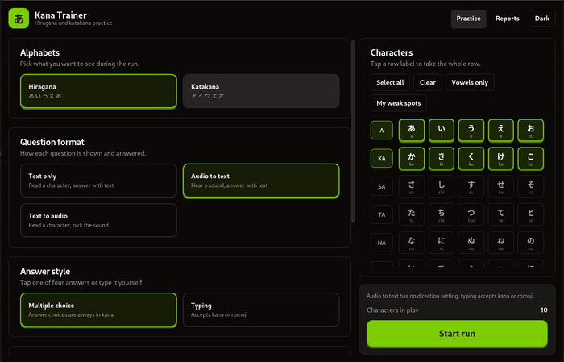

# kana-trainer

[](https://crates.io/crates/kana-trainer)
[](https://crates.io/crates/kana-trainer)
[](https://github.com/arsalan-anwari/kana-trainer/actions/workflows/ci.yml)
[](LICENSE)

Desktop trainer for the hiragana and katakana alphabets. Built with Tauri 2, Svelte 5 and a theme ported from kasumi-ui.



## What it does

- Practice hiragana, katakana or both, in either direction (kana to romaji, romaji to kana or mixed)
- Three question formats: text to text, audio to text and text to audio
- Two answer styles: multiple choice with four options, or typing the romaji yourself
- Time trial with 5, 10, 15 or 30 seconds per question and an optional limit for the whole run
- Pick single characters, whole rows, or the characters you keep getting wrong
- Optional dakuten and handakuten rows (text to text only for now)
- Score reports saved on disk, loaded and exported as JSON files
- Charts for the characters, rows and alphabets you struggle with
- One click to turn past mistakes into a new practice set

## Requirements

- Rust 1.77 or newer
- Node 20 or newer
- On Linux: webkit2gtk 4.1, gtk3 and the distro base build tools


## Installing

From crates.io:

```sh
cargo install kana-trainer
```

From a Linux package:

```sh
sudo dnf install ./dist/release/*.rpm                  # fedora, opensuse
sudo apt install ./dist/release/*.deb                  # debian 12+, ubuntu 22.04+
chmod +x dist/release/*.AppImage && ./dist/release/*.AppImage   # any distro
sudo pacman -U dist/release/*.pkg.tar.zst              # arch
flatpak install --user dist/release/*.flatpak          # any distro with flatpak
```

## Keyboard Shortcuts

- `1` to `4` picks an answer in multiple choice
- `Enter` submits a typed answer and moves on after feedback
- `r` replays the sound in audio questions
- `Escape` leaves the run

## Credits

- Character sounds from [digitaIfabric/japanese](https://github.com/digitaIfabric/japanese)
- Theme from [kasumi-ui](https://github.com/ashunar0/kasumi-ui)
