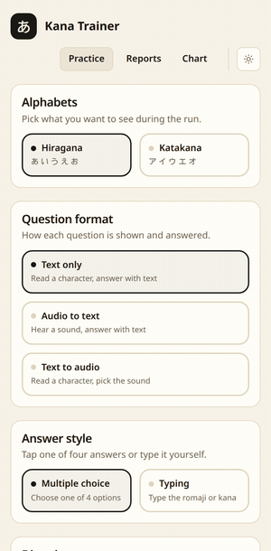

# kana-trainer

[](https://crates.io/crates/kana-trainer)
[](https://github.com/arsalan-anwari/kana-trainer/releases)
[](https://crates.io/crates/kana-trainer)
[](https://github.com/arsalan-anwari/kana-trainer/actions/workflows/ci.yml)
[](LICENSE)
[](https://arsalan-anwari.github.io/kana-trainer/)
[](https://apps.microsoft.com/detail/9pbn4s73d1qc)

Trainer for the hiragana and katakana alphabets, on desktop, tablet and phone.
Built with Tauri 2 and Svelte 5, in cream paper and black ink.

<table>
  <tr>
    <td align="center" valign="bottom">
      
    </td>
    <td align="center" valign="bottom">
      
    </td>
  </tr>
  <tr>
    <td align="center">
      <b>Desktop</b><br>
    </td>
    <td align="center">
      <b>Phone</b><br>
    </td>
  </tr>
</table>

## Features

- Hiragana, katakana or both, in either direction, from single characters up to all 104 including the dakuon, handakuon and yoon rows
- Three question formats (text to text, audio to text, text to audio) and answers by multiple choice or typing
- Runs of 10 to 500 questions or one pass over the set, at three difficulty levels that decide how look alike the wrong answers are
- Optional time trial, per question and for the whole run.
- Chart view of every character grouped by sound type and row, tap a tile to hear it
- Score reports saved on disk, exported and imported as `.kt-report` files holding any number of runs. Easy migration of runs to other devices. 
- Responsive interface, the same app on a wide screen and on a phone
- Works on Linux, Windows, MacOS and Android.

## Installing

### Manually

[https://arsalan-anwari.github.io/kana-trainer/](https://arsalan-anwari.github.io/kana-trainer/)

```sh
sudo dnf install ./kana-trainer-*.rpm            # fedora, opensuse
sudo apt install ./kana-trainer_*.deb            # debian 13+, ubuntu 24.04+
sudo pacman -U ./kana-trainer-*.pkg.tar.zst      # arch
adb install ./kana-trainer-*.apk                 # android
```

Or run exe/dmg package with your OS package installer. 

### From crates.io

```sh
cargo install kana-trainer
```


## Development

Needs Node 22+ and Rust 1.77+, plus the GTK and WebKit development headers.

```sh
# fedora
sudo dnf install webkit2gtk4.1-devel gtk3-devel glib2-devel librsvg2-devel \
                 libsoup3-devel openssl-devel dbus-devel patchelf \
                 libappstream-glib rpm-build dpkg

# debian, ubuntu
sudo apt install libwebkit2gtk-4.1-dev libgtk-3-dev libglib2.0-dev librsvg2-dev \
                 libsoup-3.0-dev libssl-dev libdbus-1-dev patchelf \
                 build-essential curl wget file rpm

# arch
sudo pacman -S webkit2gtk-4.1 gtk3 glib2 librsvg libsoup3 openssl dbus \
               patchelf base-devel rpm-tools
```

`rpm-build`/`rpm`/`rpm-tools` and `dpkg` are only needed for the `.rpm` and
`.deb` bundle targets, `patchelf` for bundling in general. On Arch `dpkg` comes
from the AUR.

```sh
npm ci
npm run tauri:dev      # run the app against the vite dev server
npm run tauri:build    # bundle for the current platform
npm test               # unit tests
npm run test:e2e       # playwright
```

## Keyboard Shortcuts

- `1` to `4` picks an answer in multiple choice
- `Enter` submits a typed answer, submits the picked sound in text to audio, and
  moves on after feedback
- `r` replays the sound in audio questions
- `Escape` leaves the run
- `Shift+left` and `Shift+right` move between pages.

## Credits

- Character sounds from [Learn Japanese Adventure](https://www.learn-japanese-adventure.com/learn-how-to-speak-japanese.html) (CC BY 4.0), pitch and loudness normalised with `scripts/normalize-audio.py`. Upload available on [Hugging Face](https://huggingface.co/datasets/arsalan-anwari/kana-sounds).
