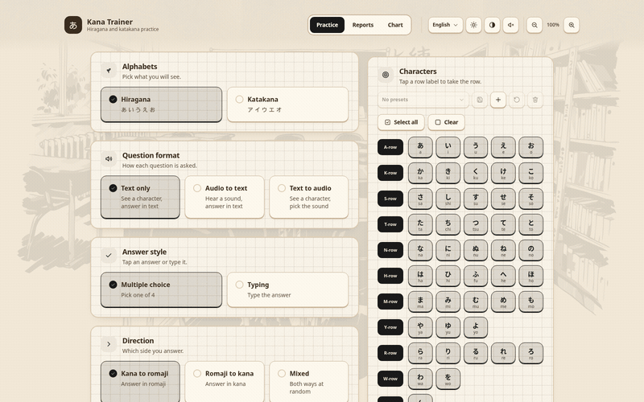
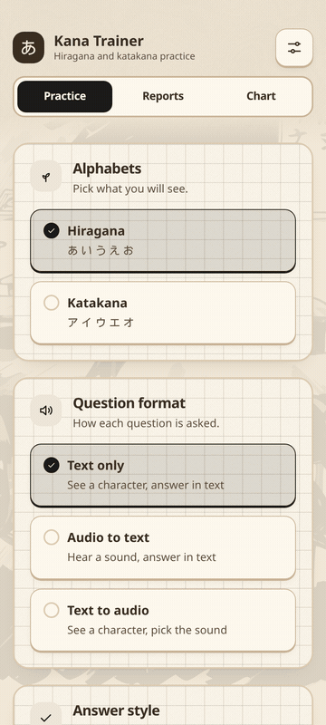

# kana-trainer

[](https://crates.io/crates/kana-trainer)
[](https://github.com/arsalan-anwari/kana-trainer/releases)
[](https://crates.io/crates/kana-trainer)
[](https://github.com/arsalan-anwari/kana-trainer/actions/workflows/ci.yml)
[](LICENSE)
[](https://arsalan-anwari.github.io/kana-trainer/)

Trainer for the hiragana and katakana alphabets, on desktop, tablet and phone.
Built with Tauri 2 and Svelte 5, in cream paper and black ink.

See the [roadmap](ROADMAP.md) for planned features and improvements.

<table>
  <tr>
    <td align="center" valign="bottom">
      
    </td>
    <td align="center" valign="bottom">
      
    </td>
  </tr>
  <tr>
    <td align="center">
      <b>Desktop</b><br>
    </td>
    <td align="center">
      <b>Phone</b><br>
    </td>
  </tr>
</table>

## Features

- Hiragana, katakana or both, in either direction, from single characters up to all 147 including the dakuon, handakuon and yoon rows, plus the katakana only tokushon
- Three question formats (text to text, audio to text, text to audio) and answers by multiple choice or typing
- Runs of 10 to 500 questions or one pass over the set, at three difficulty levels that decide how look alike the wrong answers are
- Optional time trial, per question and for the whole run.
- Chart view of every character grouped by sound type and row, tap a tile to hear it
- Score reports saved on disk, exported and imported as `.kt-report` files holding any number of runs. Easy migration of runs to other devices. 
- Responsive interface, the same app on a wide screen and on a phone
- Localization for 17 languages: Arabic, Dutch, English, Farsi, French, German, Hebrew, Indonesian, Korean, Portuguese (Brazilian), Russian, Spanish, Thai, Turkish, Vietnamese, and Chinese (simplified and traditional).
- Support for WCAG 2.2 AA accessibility, including high contrast mode, screen reader support and keyboard navigation.
- Works on Linux, Windows, MacOS and Android.

## Installing

<table>
  <tr>
    <td align="center"><a href=""></a></td>
    <td align="center"><a href=""></a></td>
    <td align="center"><a href=""></a></td>
  </tr>
  <tr>
    <td align="center"><a href=""></a></td>
    <td align="center"><a href=""></a></td>
    <td align="center"><a href=""></a></td>
  </tr>
  <tr>
    <td align="center"><a href=""></a></td>
    <td align="center"><a href=""></a></td>
    <td align="center"><a href=""></a></td>
  </tr>
</table>

### Manually

[https://arsalan-anwari.github.io/kana-trainer/](https://arsalan-anwari.github.io/kana-trainer/)

```sh
sudo dnf install ./kana-trainer-*.rpm            # fedora, opensuse
sudo apt install ./kana-trainer_*.deb            # debian 13+, ubuntu 24.04+
sudo pacman -U ./kana-trainer-*.pkg.tar.zst      # arch
```

Or run apk/exe/dmg package with your OS package installer. 

### From crates.io

```sh
cargo install kana-trainer
```


## Development

Needs Node 22+ and Rust 1.77+, plus the GTK and WebKit development headers.

```sh
# fedora
sudo dnf install webkit2gtk4.1-devel gtk3-devel glib2-devel librsvg2-devel \
                 libsoup3-devel openssl-devel dbus-devel patchelf \
                 libappstream-glib rpm-build dpkg

# debian, ubuntu
sudo apt install libwebkit2gtk-4.1-dev libgtk-3-dev libglib2.0-dev librsvg2-dev \
                 libsoup-3.0-dev libssl-dev libdbus-1-dev patchelf \
                 build-essential curl wget file rpm

# arch
sudo pacman -S webkit2gtk-4.1 gtk3 glib2 librsvg libsoup3 openssl dbus \
               patchelf base-devel rpm-tools
```

`rpm-build`/`rpm`/`rpm-tools` and `dpkg` are only needed for the `.rpm` and
`.deb` bundle targets, `patchelf` for bundling in general. On Arch `dpkg` comes
from the AUR.

```sh
git submodule update --init   # vendor/kaizen-ui, the UI kit
npm ci
npm run tauri:dev      # run the app against the vite dev server
npm run tauri:build    # bundle for the current platform
npm test               # unit tests
npm run test:e2e       # playwright
```

## Keyboard Shortcuts

Desktop only. Press `Ctrl+/` to start keyboard mode and `Ctrl+Shift+/` to stop
it; outside the mode these shortcuts do nothing. A badge in the top left shows when
the mode is on. Press `?` anywhere for a list of shortcuts.

`Shift+up` and `Shift+down` walk between sections; the current section is
outlined in blue.  `Tab` and `Shift+Tab` navigation only works in the active section.

### Menus and pages

| Key | Does |
| --- | --- |
| `Ctrl+/` | Start keyboard mode |
| `Ctrl+Shift+/` | Stop keyboard mode |
| `Shift+up` / `Shift+down` | Move between sections |
| `Tab` / `Shift+Tab` | Next or previous element in the section |
| `up` / `down` | First or last element in the section |
| `Ctrl+up` / `Ctrl+down` | Scroll the page |
| `Space` | Select what is focused |
| `Enter` | Confirm what is focused |
| `Ctrl+left` / `Ctrl+right` | Switch between Practice, Reports and Chart |
| `Escape` | Close a dialog, sheet or picker |
| `?` | Show the shortcut list |

### During a run

| Key | Does |
| --- | --- |
| `1` to `4` | Pick an answer in multiple choice |
| `Enter` | Submit a typed answer or a picked sound, then move on |
| `r` | Replay the sound in audio questions |
| `Escape` | Leave the run |

## Credits

- Character sounds from [FUN Japanese Learning](https://funjapaneselearning.com) (CC BY 4.0). Upload available on [Hugging Face](https://huggingface.co/datasets/arsalan-anwari/kana-sounds).
